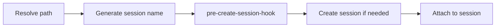

# Tmux session wizard


One prefix key to rule them all (with [fzf](https://github.com/junegunn/fzf) & [zoxide](https://github.com/ajeetdsouza/zoxide)):

- Creating a new session from a list of recently accessed directories
- Naming a session after a directory/project
- Switching sessions
- Viewing current or creating new sessions in one popup
- Killing sessions from the same popup (`ctrl-x`)
- Optionally previewing sessions & directories in the popup

### Elevator Pitch

Tmux is powerful, yes, but why is creating/switching sessions (arguably its main feature) is so damn hard to do? To create a new session for a project you have to run `tmux new-session -s <session-name> -c <project-directory>`. What if you're inside tmux? Oh, wait you have to use `-d` followed by `tmux switch-client -t <session-name>`. Oh, wait again! What if you're outside tmux and you want to attach to an existing session? now you have to run `tmux attach -t <session-name>` instead. What if you can't remember whether you have a session for that project or not. Guess what? Now you have to run `tmux has-session -t <session-name>`. What if your project folder contains characters not accepted by tmux as a session name? What if you want to show a list of existing sessions? You run `tmux list-sessions`. What if you want to create a session for a project you've recently navigated to? What if, what if, what if.... HOW IS THAT BETTER THAN HAVING 20 TERMINAL WINDOWS OPEN?

What if you could use 1 prefix key to do all of this? Read on!

### Features

`prefix + T` (customisable) - displays a pop-up with [fzf](https://github.com/junegunn/fzf) which displays the existing sessions followed by recently accessed directories (using [zoxide](https://github.com/ajeetdsouza/zoxide)). Choose the session or the directory and voila! You're in that session. If the session doesn't exist, it will be created.

Inside the pop-up, highlight a session and press `ctrl-x` to kill it. The list refreshes in place without closing the pop-up. (The `ctrl-x: kill session` hint line requires fzf ≥ 0.64; the binding itself works on older fzf versions.)

### Required

You must have [fzf](https://github.com/junegunn/fzf), [zoxide](https://github.com/ajeetdsouza/zoxide) installed and available in your path.

### Installation with [Tmux Plugin Manager](https://github.com/tmux-plugins/tpm) (recommended)

Add plugin to the list of TPM plugins in `.tmux.conf`:

```tmux
set -g @plugin '27medkamal/tmux-session-wizard'
```

Hit `prefix + I` to fetch the plugin and source it. That's it!

### Manual Installation

Clone the repo:

    git clone https://github.com/27medkamal/tmux-session-wizard ~/clone/path

Add this line to the bottom of `.tmux.conf`:

```tmux
run-shell ~/clone/path/tmux-session-wizard.tmux
```

Reload TMUX environment with `$ tmux source-file ~/.tmux.conf`, and that's it.

### Customisation

You can customise the prefix key by adding this line to your `.tmux.conf`:

```tmux
set -g @session-wizard 'T'
set -g @session-wizard 'T K' # for multiple key bindings
```

You can also customise the height and width of the tmux popup by adding the following lines to your `.tmux.conf`:

```tmux
set -g @session-wizard-height 40
set -g @session-wizard-width 80
```

To customise the way session names are created, use `@session-wizard-mode` option. Allowed values are:

- `directory` (default)
- `full-path`
- `short-path`

```tmux
set -g @session-wizard-mode "full-path"
```

By default, `tmux-session-wizard` gives you a list of open sessions (hence the name). An alternative is that it gives you a list of _windows_ to choose from. This can be turned on using the setting `@session-wizard-windows`. Add this line to your `.tmux.conf` to enable this behaviour:

```tmux
set -g @session-wizard-windows on # default is off
```

You can enable a preview pane in the popup with `@session-wizard-preview`. Session and window entries preview the target pane's contents; directory entries preview a directory listing, using [eza](https://github.com/eza-community/eza) (`--tree --level=1`) when it's installed and plain `ls` otherwise:

```tmux
set -g @session-wizard-preview on # default is off
```

### (Optional) Using the script outside of tmux

**Note:** you'll need to check the path of your tpm plugins. It may be `~/.tmux/plugins` or `~/.config/tmux/plugins` depending on where your `tmux.conf` is located.

<details>
<summary>bash</summary>

Add the following line to `~/.bashrc`

```sh
# ~/.tmux/plugins
export PATH=$HOME/.tmux/plugins/tmux-session-wizard/bin:$PATH
# ~/.config/tmux/plugins
export PATH=$HOME/.config/tmux/plugins/tmux-session-wizard/bin:$PATH
```

</details>

<details>
<summary>zsh</summary>

Add the following line to `~/.zprofile`

```sh
# ~/.tmux/plugins
export PATH=$HOME/.tmux/plugins/tmux-session-wizard/bin:$PATH
# ~/.config/tmux/plugins
export PATH=$HOME/.config/tmux/plugins/tmux-session-wizard/bin:$PATH
```

</details>

<details>
<summary>fish</summary>

Add the following line to `~/.config/fish/config.fish`

```fish
# ~/.tmux/plugins
fish_add_path $HOME/.tmux/plugins/tmux-session-wizard/bin
# ~/.config/tmux/plugins
fish_add_path $HOME/.config/tmux/plugins/tmux-session-wizard/bin
```

</details>

You can then run `t` from anywhere to use the script.

You can also run `t` with a relative or absolute path to a directory (similar to [zoxide](https://github.com/ajeetdsouza/zoxide)) to create a session for that directory. For example, `t ~/projects/my-project` will create a session named `my-project` and cd into that directory.

Also, depending on the terminal emulator you use, you can make it always start what that script.

### Extending the plugin

This is a simplified diagram of how the plugin works. You can extend its behaviour with the `pre-create-session-hook`.



#### pre-create-session-hook

The hook runs every time a session is about to be created or reused for a directory, before checking whether the session already exists. It allows you to modify the session name, the target directory, or both.

The hook is invoked as:

```
<your-hook> <session-name> <target-directory>
```

Contract:

1. Print two lines to stdout (session name, then target directory) to replace both values.
2. Print nothing to keep the original values.
3. Exit non-zero to abort: no session is created and nothing is attached.

**Configuration:**

```tmux
set -g @session-wizard-pre-create-session-hook '/path/to/hook-script.sh'
```

**Example** — prefix every session name:

```bash
#!/bin/bash
echo "work-$1"
echo "$2"
```

A more complete example is in [`examples/resolve-session-conflict-hook.sh`](examples/resolve-session-conflict-hook.sh). It handles two different directories generating the same session name (e.g. two projects both called `api`): when a conflict is detected it prompts for a new name via fzf and remembers the choice for the rest of the boot.

#### Debug logging

Set `@session-wizard-log-file` to a writable path to get timestamped debug logs (hook invocations, session creation). Logging is off unless the option is set:

```tmux
set -g @session-wizard-log-file '/tmp/session-wizard.log'
```

### Development

Tests use [bats](https://github.com/bats-core/bats-core) with the `bats-support` and `bats-assert` libraries. With those installed locally, run:

```bash
bats -r ./tests
```

The integration tests run a tmux server on an isolated socket (`TMUX_TMPDIR`), so they are safe to run on your machine — even from inside a tmux session — without touching your real sessions.

Alternatively, build the Docker image and run the tests in a container:

```bash
docker build --tag tmux-session-wizard:dev --file ./Dockerfile .
docker run --rm -it -u $(id -u):$(id -g) -v $PWD:$PWD -w $PWD tmux-session-wizard:dev bats -r ./tests
```

There is also a helper script, _./scripts/run-tests.sh_; run `./scripts/run-tests.sh -h` for usage.

A community-maintained Nix flake (`nix develop`) also provides a development environment.

### Inspiration

- ThePrimeagen's [tmux-sessionizer](https://github.com/ThePrimeagen/.dotfiles/blob/master/bin/.local/scripts/tmux-sessionizer)
- Josh Medeski's [t-smart-tmux-session-manager](https://github.com/joshmedeski/t-smart-tmux-session-manager)

### Contributors 🙌

<a href="https://github.com/27medkamal/tmux-session-wizard/graphs/contributors">
  
</a>

### License

[MIT](LICENCE.md)
