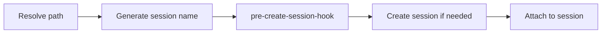

# Tmux session wizard


One prefix key to rule them all (with [fzf](https://github.com/junegunn/fzf) & [zoxide](https://github.com/ajeetdsouza/zoxide)):

- Creating a new session from a list of recently accessed directories
- Naming a session after a directory/project
- Switching sessions
- Viewing current or creating new sessions in one popup

### Elevator Pitch

Tmux is powerful, yes, but why is creating/switching sessions (arguably its main feature) is so damn hard to do? To create a new session for a project you have to run `tmux new-session -s <session-name> -c <project-directory>`. What if you're inside tmux? Oh, wait you have to use `-d` followed by `tmux switch-client -t <session-name>`. Oh, wait again! What if you're outside tmux and you want to attach to an existing session? now you have to run `tmux attach -t <session-name>` instead. What if you can't remember whether you have a session for that project or not. Guess what? Now you have to run `tmux has-session -t <session-name>`. What if your project folder contains characters not accepted by tmux as a session name? What if you want to show a list of existing sessions? You run `tmux list-sessions`. What if you want to create a session for a project you've recently navigated to? What if, what if, what if.... HOW IS THAT BETTER THAN HAVING 20 TERMINAL WINDOWS OPEN?

What if you could use 1 prefix key to do all of this? Read on!

### Features

`prefix + T` (customisable) - displays a pop-up with [fzf](https://github.com/junegunn/fzf) which displays the existing sessions followed by recently accessed directories (using [zoxide](https://github.com/ajeetdsouza/zoxide)). Choose the session or the directory and voila! You're in that session. If the session doesn't exist, it will be created.

### Required

You must have [fzf](https://github.com/junegunn/fzf), [zoxide](https://github.com/ajeetdsouza/zoxide) installed and available in your path.

### Installation with [Tmux Plugin Manager](https://github.com/tmux-plugins/tpm) (recommended)

Add plugin to the list of TPM plugins in `.tmux.conf`:

```tmux
set -g @plugin '27medkamal/tmux-session-wizard'
```

Hit `prefix + I` to fetch the plugin and source it. That's it!

### Manual Installation

Clone the repo:

    git clone https://github.com/27medkamal/tmux-session-wizard ~/clone/path

Add this line to the bottom of `.tmux.conf`:

```tmux
run-shell ~/clone/path/tmux-session-wizard.tmux
```

Reload TMUX environment with `$ tmux source-file ~/.tmux.conf`, and that's it.

### Customisation

You can customise the prefix key by adding this line to your `.tmux.conf`:

```tmux
set -g @session-wizard 'T'
set -g @session-wizard 'T K' # for multiple key bindings
```

You can also customise the height and width of the tmux popup by adding the following lines to your `.tmux.conf`:

```tmux
set -g @session-wizard-height 40
set -g @session-wizard-width 80
```

To customise the way session names are created, use `@session-wizard-mode` option. Allowed values are:

- `directory` (default)
- `full-path`
- `short-path`

```tmux
set -g @session-wizard-mode "full-path"
```

By default, `tmux-session-wizard` gives you a list of open sessions (hence the name). An alternative is that it gives you a list of _windows_ to choose from. This can be turned on using the setting `@session-wizard-windows`. Add this line to your `.tmux.conf` to enable this behaviour:

```tmux
set -g @session-wizard-windows on # default is off
```

### (Optional) Using the script outside of tmux

**Note:** you'll need to check the path of your tpm plugins. It may be `~/.tmux/plugins` or `~/.config/tmux/plugins` depending on where your `tmux.conf` is located.

<details>
<summary>bash</summary>

Add the following line to `~/.bashrc`

```sh
# ~/.tmux/plugins
export PATH=$HOME/.tmux/plugins/tmux-session-wizard/bin:$PATH
# ~/.config/tmux/plugins
export PATH=$HOME/.config/tmux/plugins/tmux-session-wizard/bin:$PATH
```

</details>

<details>
<summary>zsh</summary>

Add the following line to `~/.zprofile`

```sh
# ~/.tmux/plugins
export PATH=$HOME/.tmux/plugins/tmux-session-wizard/bin:$PATH
# ~/.config/tmux/plugins
export PATH=$HOME/.config/tmux/plugins/tmux-session-wizard/bin:$PATH
```

</details>

<details>
<summary>fish</summary>

Add the following line to `~/.config/fish/config.fish`

```fish
# ~/.tmux/plugins
fish_add_path $HOME/.tmux/plugins/tmux-session-wizard/bin
# ~/.config/tmux/plugins
fish_add_path $HOME/.config/tmux/plugins/tmux-session-wizard/bin
```

</details>

You can then run `t` from anywhere to use the script.

You can also run `t` with a relative or absolute path to a directory (similar to [zoxide](https://github.com/ajeetdsouza/zoxide)) to create a session for that directory. For example, `t ~/projects/my-project` will create a session named `my-project` and cd into that directory.

Also, depending on the terminal emulator you use, you can make it always start what that script.

### Extending plugin's functionality

This is simplified diagram of how the plugin works. You can extend its functionality using the `pre-create-session-hook`.



#### pre-create-session-hook

The hook runs every time the plugin is invoked, before checking whether the session already exists. This allows you to modify the session name, the target directory, or both.

The hook receives two positional arguments:
- `$1` - session name
- `$2` - target directory

To modify values, the hook should print two lines to stdout:
1. The session name (first line)
2. The target directory (second line)

If the hook prints nothing, the original values are used unchanged.

**Configuration:**

Set the `@session-wizard-pre-create-session-hook` tmux option to a script or command:

```bash
set -g @session-wizard-pre-create-session-hook '/path/to/hook-script.sh'
```

**Examples:**
These examples are not very realistic usecases, just to see basic usage of hook. More realistic example is in examples folder.

Add a prefix to all session names:

```bash
#!/bin/bash
echo "work-$1"
echo "$2"
```

Log session creation without modifying anything (output nothing to keep original values):

```bash
#!/bin/bash
echo "$(date) - session: $1, dir: $2" >> /tmp/session-wizard.log
```

#### Resolve session conflict hook

A more complete example is provided in [`examples/resolve-session-conflict-hook.sh`](examples/resolve-session-conflict-hook.sh). It handles the case where two different directories generate the same session name (e.g. both have a subdirectory called `src`). When a conflict is detected, it prompts the user via fzf to pick a new name and remembers the choice in `/tmp/tmux-session-wizard-mappings` (resets on reboot).

```bash
set -g @session-wizard-pre-create-session-hook '/path/to/resolve-session-conflict-hook.sh'
```

### Development

The development environment is built with Nix and Nix's Flakes, if you have it on your system then just run `nix develop` and you are ready to go. Other method is to build the Docker image based on provided Dockerfile:

```bash
docker build --tag tmux-session-wizard:dev --file ./Dockerfile .
```

To run the tests, just run `bats -r ./tests` for local development environment or `docker run --rm -it -u $(id -u):$(id -g) -v $PWD:$PWD -w $PWD tmux-session-wizard:dev bats -r ./tests` if you are using Docker.

There is also the helper script for it _./scripts/run-tests.sh_, run `./scripts/run-tests.sh -h` to get more information about usage.

### Inspiration

- ThePrimeagen's [tmux-sessionizer](https://github.com/ThePrimeagen/.dotfiles/blob/master/bin/.local/scripts/tmux-sessionizer)
- Josh Medeski's [t-smart-tmux-session-manager](https://github.com/joshmedeski/t-smart-tmux-session-manager)

### Contributors 🙌

<a href="https://github.com/27medkamal/tmux-session-wizard/graphs/contributors">
  
</a>

### License

[MIT](LICENCE.md)
